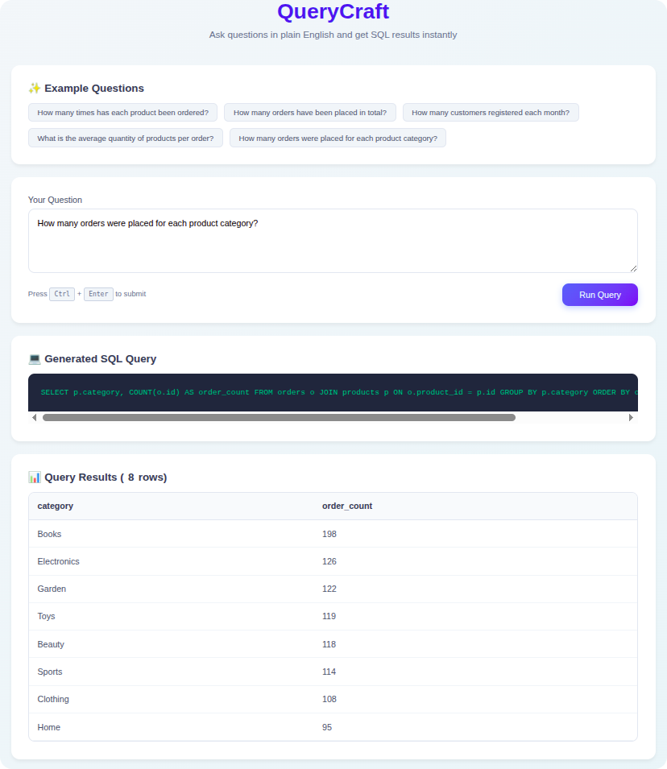
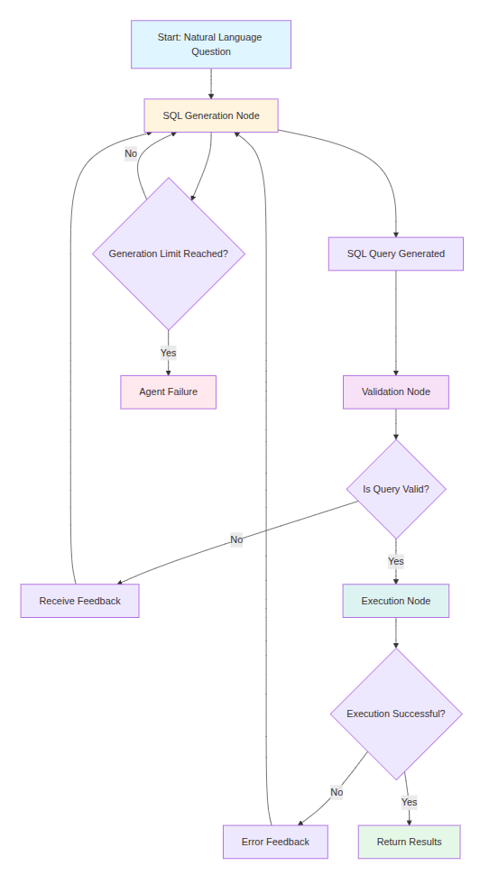

<div align="center">



</div>

# QueryCraft

QueryCraft is a web application that enables non-technical users to query a PostgreSQL database using natural language questions. The system converts these questions into SQL queries using an AI agent powered by the SQLCoder LLM model and LangGraph workflow, executes the queries, and returns the results in a user-friendly format.

## Project Structure

```
querycraft/                # Django project root
├── query_api/             # Backend API app
├── sql_agent/             # AI agent core logic for SQL generation
├── ui/                    # Frontend UI app
├── querycraft/            # Django project configuration
├── Dockerfile             # Docker image build instructions
├── docker-compose.yml     # Docker Compose configuration
├── docker-compose.gpu.yml # Docker Compose config for GPU acceleration
├── .env.template          # Environment variable template
```

## System Architecture Overview

QueryCraft follows a decoupled three-tier architecture with well-defined responsibilities and interactions between components:

- **Backend (`query_api`)**: A Django REST Framework service that exposes a `/api/query/` endpoint to handle natural language queries. It validates incoming requests using DRF serializers, instantiates a `SyncAgent` for SQL processing, and returns structured responses containing the question, generated SQL query, and results or errors.

- **AI Agent (`sql_agent`)**: Implements a LangGraph state machine orchestrating the conversion of natural language questions into SQL queries. It includes:
  * `sql_generation_node`: Uses the [SQLCoder model](https://github.com/defog-ai/sqlcoder) via Ollama to generate SQL from questions and feedback
  * `validation_node`: Enforces query safety by checking for dangerous keywords
  * `execution_node`: Executes validated queries against PostgreSQL and handles database errors
  The agent includes a feedback loop allowing iterative refinement of queries based on validation or execution failures.

- **Frontend (`ui`)**: A Django app serving a static HTML interface with JavaScript client-side logic. It presents an input area for questions, displays generated SQL, and renders tabular query results. The frontend communicates with the backend via POST requests to `/api/query/`, handling error states and providing example questions.

The components work together to transform user questions into SQL queries, execute them safely, and present results through the user interface.

<div align="center">
  


</div>

## Quick Start

### Prerequisites

- Docker
- Docker Compose

### Setup

1. Clone the repository:
   ```bash
   git clone <repository-url>
   cd querycraft
   ```

2. Copy the environment template and configure your settings:
   ```bash
   cp .env.template .env
   # Edit .env file to set your preferred values
   ```

3. Start the services:
   ```bash
   docker-compose up
   ```

4. Access the application at `http://localhost:8000`


5. Access the admin interface at `http://localhost:8000/admin`
- Default username: `admin` (or as configured in `.env`)
- Default password: `admin` (or as configured in `.env`)

## GPU Acceleration

### Prerequisites

- NVIDIA Container Toolkit

To use GPU acceleration for the [Ollama](https://github.com/ollama/ollama):

```bash
docker-compose -f docker-compose.yml -f docker-compose.gpu.yml up
```


## Environment Variables

| Variable | Default | Description |
|----------|---------|-------------|
| `DEBUG` | 1 | Set to 1 for development, 0 for production |
| `SECRET_KEY` | - | Django secret key for security |
| `DB_NAME` | querycraft_db | PostgreSQL database name |
| `DB_USER` | postgres | PostgreSQL user |
| `DB_PASSWORD` | postgres | PostgreSQL password |
| `DB_HOST` | db | PostgreSQL host |
| `DB_PORT` | 5432 | PostgreSQL port |
| `OLLAMA_BASE_URL` | http://ollama:11434/ | URL for Ollama service |
| `OLLAMA_MODEL` | hf.co/MaziyarPanahi/sqlcoder-7b-2-GGUF:Q4_K_M | Ollama model to use |
| `LANGFUSE_SECRET_KEY` | - | Langfuse secret key (optional) |
| `LANGFUSE_PUBLIC_KEY` | - | Langfuse public key (optional) |
| `LANGFUSE_HOST` | - | Langfuse host (optional) |
| `LANGFUSE_ENABLED` | false | Enable Langfuse tracing |
| `DJANGO_SUPERUSER_USERNAME` | admin | Username for the Django admin superuser |
| `DJANGO_SUPERUSER_EMAIL` | admin@example.com | Email for the Django admin superuser |
| `DJANGO_SUPERUSER_PASSWORD` | admin | Password for the Django admin superuser (change in production) |